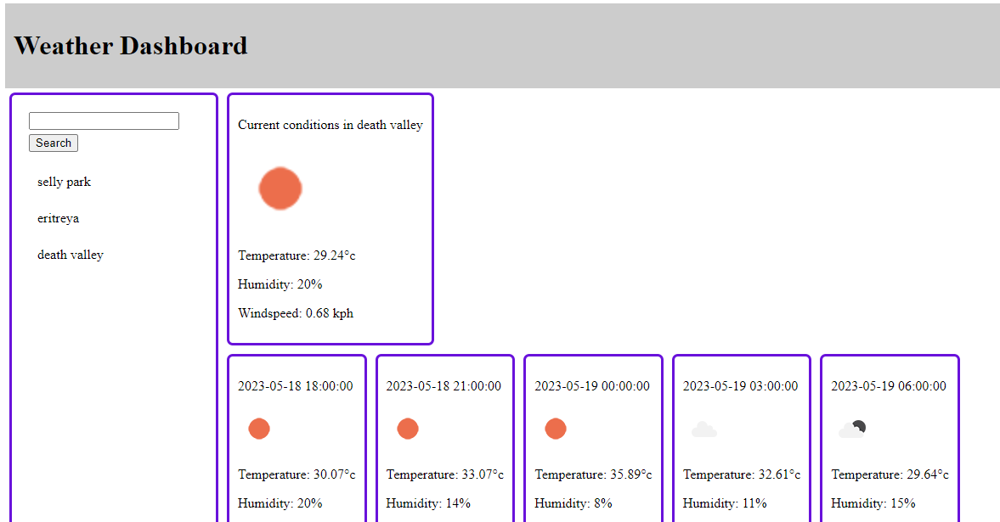

# README - weatherApp

Birmingham coding bootcamp week six challenge was to create a weather dashboard application.

## Description

The weather app presents a dashboard where a city can be added to a search history. When viewing current conditions for the city, the city name, date, an icon with representation of weather conditions, the temperature, the humidity and the windspeed are presented. Future conditions are also presented with the same items.

When clicking a city in the search history, the current and future conditions are again presented.

## Installation

N/A

## Credits

Based on class examples and tutorials found on google.

## License

Please refer to the LICENSE in the repo.

## Screenshot

